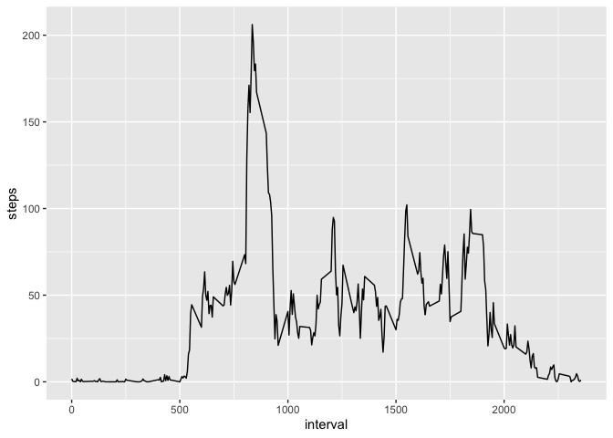

## Loading Data

```r
library(dplyr)
```

```
## 
## Attaching package: 'dplyr'
```

```
## The following objects are masked from 'package:stats':
## 
##     filter, lag
```

```
## The following objects are masked from 'package:base':
## 
##     intersect, setdiff, setequal, union
```


```r
## Make sure that the file is in working directory.
data<-read.csv("activity.csv")
```
## What is the mean total numbers of steps taken per day?
### 1.Total number of steps each day

```r
DayStepsSum<-tapply(data$steps,data$date,sum)
print(DayStepsSum)
```

```
## 2012-10-01 2012-10-02 2012-10-03 2012-10-04 2012-10-05 2012-10-06 2012-10-07 
##         NA        126      11352      12116      13294      15420      11015 
## 2012-10-08 2012-10-09 2012-10-10 2012-10-11 2012-10-12 2012-10-13 2012-10-14 
##         NA      12811       9900      10304      17382      12426      15098 
## 2012-10-15 2012-10-16 2012-10-17 2012-10-18 2012-10-19 2012-10-20 2012-10-21 
##      10139      15084      13452      10056      11829      10395       8821 
## 2012-10-22 2012-10-23 2012-10-24 2012-10-25 2012-10-26 2012-10-27 2012-10-28 
##      13460       8918       8355       2492       6778      10119      11458 
## 2012-10-29 2012-10-30 2012-10-31 2012-11-01 2012-11-02 2012-11-03 2012-11-04 
##       5018       9819      15414         NA      10600      10571         NA 
## 2012-11-05 2012-11-06 2012-11-07 2012-11-08 2012-11-09 2012-11-10 2012-11-11 
##      10439       8334      12883       3219         NA         NA      12608 
## 2012-11-12 2012-11-13 2012-11-14 2012-11-15 2012-11-16 2012-11-17 2012-11-18 
##      10765       7336         NA         41       5441      14339      15110 
## 2012-11-19 2012-11-20 2012-11-21 2012-11-22 2012-11-23 2012-11-24 2012-11-25 
##       8841       4472      12787      20427      21194      14478      11834 
## 2012-11-26 2012-11-27 2012-11-28 2012-11-29 2012-11-30 
##      11162      13646      10183       7047         NA
```
### 2.Histogram plot

```r
{hist(DayStepsSum,col="blue",main = "Histogram of total number of steps")}
```

<!-- -->

### 3.Mean and median

```r
meanDaySteps<-mean(DayStepsSum,na.rm = TRUE)
medianDaySteps<-median(DayStepsSum,na.rm = TRUE)
```
#### Mean

```r
print(meanDaySteps)
```

```
## [1] 10766.19
```
#### Median

```r
print(medianDaySteps)
```

```
## [1] 10765
```

## What is the average daily activity pattern?


```r
TimeStepsMean<-aggregate(steps~interval,data,mean)
head(TimeStepsMean)
```

```
##   interval     steps
## 1        0 1.7169811
## 2        5 0.3396226
## 3       10 0.1320755
## 4       15 0.1509434
## 5       20 0.0754717
## 6       25 2.0943396
```
### 1.Time Series Plot

```r
library(ggplot2)
p<-ggplot(TimeStepsMean,aes(interval,steps,)) + geom_line() 
print(p)
```

<!-- -->

### 2.Max 5-min interval

```r
subMaxSteps<-subset(TimeStepsMean,TimeStepsMean$steps==max(TimeStepsMean$steps))
TimeMaxInterval<-subMaxSteps$interval
```
#### Max interval

```r
print(TimeMaxInterval)
```

```
## [1] 835
```

## Imputing Missing Values

### 1.Total number of missing Values

```r
NumMissValues<-sum(is.na(data$steps))
print(NumMissValues)
```

```
## [1] 2304
```

### 2.Strategy used for filling missing values.  
Hereby I used the mean value of the particular interval to fill in the missing values.

```r
data$intervalMean<-TimeStepsMean$steps
for (i in 1:length(data$steps)) { b<-data$steps[i]
if (is.na(b)) {data$steps[i]=data$intervalMean[i]}
}
```
### 3.New Dataset with no missing values

```r
newData<-select(data,1:3)
head(newData)
```

```
##       steps       date interval
## 1 1.7169811 2012-10-01        0
## 2 0.3396226 2012-10-01        5
## 3 0.1320755 2012-10-01       10
## 4 0.1509434 2012-10-01       15
## 5 0.0754717 2012-10-01       20
## 6 2.0943396 2012-10-01       25
```
#### Nmber of missing values in this new dataset

```r
N<-sum(is.na(newData))
print(N)
```

```
## [1] 0
```

### 4.Comparision 

```r
NDayStepsSum<-tapply(newData$steps,newData$date,sum)
NmeanDaySteps<-mean(NDayStepsSum,na.rm = TRUE)
NmedianDaySteps<-median(NDayStepsSum,na.rm = TRUE)
```
#### Histogram Plot

```r
hist(NDayStepsSum,col="green",main="Histogram of total steps per day")
```

<!-- -->

#### Mean

```r
print(NmeanDaySteps)
```

```
## [1] 10766.19
```
#### Median

```r
print(NmedianDaySteps)
```

```
## [1] 10766.19
```
#### Difference in mean

```r
print(meanDaySteps-NmeanDaySteps)
```

```
## [1] 0
```
#### Differnce in median

```r
print(medianDaySteps-NmedianDaySteps)
```

```
## [1] -1.188679
```
## Are there differences in activity patterns between weekdays and weekends?

### 1.Create a factor variable weekday and weekend according to the day

```r
newData<-transform(newData,date=as.Date(newData$date))
newData$Day <- weekdays(newData$date)

for (i in 1:length(newData$steps)) { b<-newData$Day[i]
if (b=="Saturday" | b=="Sunday") {newData$Type[i]="Weekend"}
else {newData$Type[i]="Weekday" }
}
```
#### Showing the factor variable

```r
newData<-transform(newData,Type=as.factor(newData$Type))
head(newData)
```

```
##       steps       date interval    Day    Type
## 1 1.7169811 2012-10-01        0 Monday Weekday
## 2 0.3396226 2012-10-01        5 Monday Weekday
## 3 0.1320755 2012-10-01       10 Monday Weekday
## 4 0.1509434 2012-10-01       15 Monday Weekday
## 5 0.0754717 2012-10-01       20 Monday Weekday
## 6 2.0943396 2012-10-01       25 Monday Weekday
```

```r
str(newData$Type)
```

```
##  Factor w/ 2 levels "Weekday","Weekend": 1 1 1 1 1 1 1 1 1 1 ...
```
### 2.Panel plot -> weekdays vs weekends

```r
Split<-split(newData,newData$Type)
WeekdaysTimeMean<-aggregate(steps~interval,Split$Weekday,mean)
WeekdaysTimeMean<-cbind(WeekdaysTimeMean,Type="Weekdays")
WeekendsTimeMean<-aggregate(steps~interval,Split$Weekend,mean)
WeekendsTimeMean<-cbind(WeekendsTimeMean,Type="Weekends")
TotalTimeMean<-rbind(WeekendsTimeMean,WeekdaysTimeMean)
```
#### Panel Plot

```r
library(lattice)
xyplot(steps~interval | Type ,TotalTimeMean,type="l",layout=c(1,2),ylab = "Average number of steps")
```

<!-- -->


